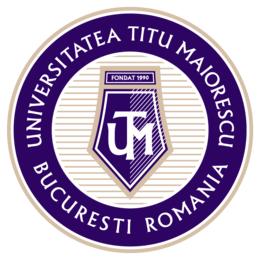

<h1 align="center">
  <a href="https://github.com/Costel03/Costel.I-UTM-Info-ID/archive/refs/heads/main.zip">
    
  </a>
</h1>

<h4 align="center">Resurse Universitatea Titu Maiorescu - Facultatea de Informatica (ID).</h4>

---

## Anul I

#### Semestrul I

- [Arhitectura sistemelor de calcul](https://github.com/Costel03/Costel.I-UTM-Info-ID/tree/main/Anul%20I/Semestrul%20I/Arhitectura%20sistemelor%20de%20calcul)
- [Calcul diferential si integral](https://github.com/Costel03/Costel.I-UTM-Info-ID/tree/main/Anul%20I/Semestrul%20I/Calcul%20diferential%20si%20integral) - mate
- [Comunicare de specialitate in limba engleza](https://github.com/Costel03/Costel.I-UTM-Info-ID/tree/main/Anul%20I/Semestrul%20I/Comunicare%20de%20specialitate%20in%20limba%20engleza)
- [Educatie fizica](https://github.com/Costel03/Costel.I-UTM-Info-ID/tree/main/Anul%20I/Semestrul%20I/Educatie%20fizica)
- [Inovare si transformare digitala](https://github.com/Costel03/Costel.I-UTM-Info-ID/tree/main/Anul%20I/Semestrul%20I/Inovare%20si%20transformare%20digitala)
- [Introducere in programare](https://github.com/Costel03/Costel.I-UTM-Info-ID/tree/main/Anul%20I/Semestrul%20I/Introducere%20in%20programare) - C
- [Logica pentru Informatica](https://github.com/Costel03/Costel.I-UTM-Info-ID/tree/main/Anul%20I/Semestrul%20I/Logica%20pentru%20Informatica)

#### Semestrul II

- [Algoritmica grafurilor](https://github.com/Costel03/Costel.I-UTM-Info-ID/tree/main/Anul%20I/Semestrul%20II/Algoritmica%20grafurilor)
- [Calcul numeric](https://github.com/Costel03/Costel.I-UTM-Info-ID/tree/main/Anul%20I/Semestrul%20II/Calcul%20numeric) - MATLAB/Octave
- [Comunicare de specialitate in limba engleza](https://github.com/Costel03/Costel.I-UTM-Info-ID/tree/main/Anul%20I/Semestrul%20II/Comunicare%20de%20specialitate%20in%20limba%20engleza)
- [Educatie fizica II](https://github.com/Costel03/Costel.I-UTM-Info-ID/tree/main/Anul%20I/Semestrul%20II/Educatie%20fizica%20II)
- [Fundamentele algebrice ale informaticii](https://github.com/Costel03/Costel.I-UTM-Info-ID/tree/main/Anul%20I/Semestrul%20II/Fundamentele%20algebrice%20ale%20informaticii)
- [Programare in Python](https://github.com/Costel03/Costel.I-UTM-Info-ID/tree/main/Anul%20I/Semestrul%20II/Programare%20in%20Python) - Python
- [Sisteme de operare](https://github.com/Costel03/Costel.I-UTM-Info-ID/tree/main/Anul%20I/Semestrul%20II/Sisteme%20de%20operare) - Linux
- [Tehnologii web](https://github.com/Costel03/Costel.I-UTM-Info-ID/tree/main/Anul%20I/Semestrul%20II/Tehnologii%20web)

---

## Linux Curs Interactiv

[`linux-curs-interactiv-simplu.sh`](./linux-curs-interactiv-simplu.sh) este un script Bash interactiv pentru studiul comenzilor Linux, bazat pe cursul **InfoAcademy Linux** (Capitolele 3, 4, 5, 6, 7, 8, 12, 13).

### Utilizare

```bash
bash linux-curs-interactiv-simplu.sh
```

> Recomandat: rulat in WSL (Windows Subsystem for Linux) sau orice terminal Linux/macOS.

### Structura

| Capitol | Subiect |
|---------|---------|
| 3 | Sistemul de Fisiere (navigare, permisiuni, arhivare) |
| 4 | Utilizatori si Permisiuni (useradd, passwd, grupuri) |
| 5 | Procese si Semnale (ps, kill, bg/fg, systemd) |
| 6 | Shell Scripting (variabile, bucle, functii, pipe) |
| 7 | Administrarea Software-ului (apt, dpkg, hardware) |
| 8 | Configurarea Retelei (ip, ping, dns, porturi) |
| 12 | Serverul E-mail (Postfix, SMTP, IMAP) |
| 13 | Serverul NTP (chrony, timedatectl) |

### Functionare

La fiecare sectiune sunt afisate **comenzile de invatat**, iar utilizatorul alege care vrea sa ruleze:

```
  ▸ Alege o comanda de rulat:

    1.  ls -la / --color=auto
    2.  df -Th | head -12

    a.  Ruleaza toate comenzile
    c.  Scrie o comanda proprie
    0.  Inapoi
```

---

## Licenta

Distribuit sub licenta [MIT](./LICENSE).

